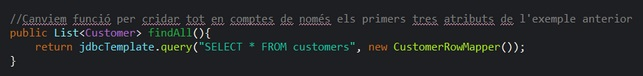
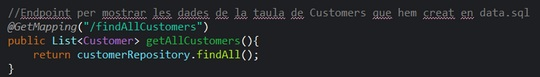
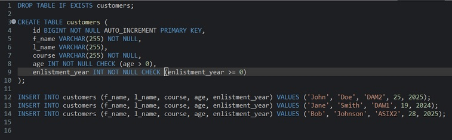
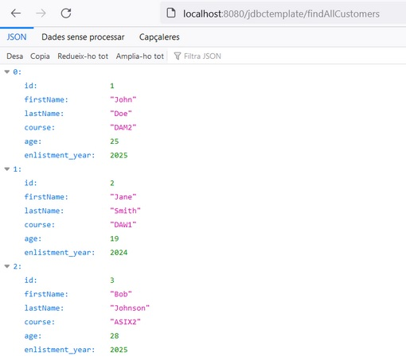
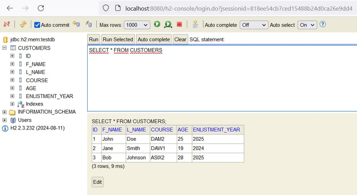
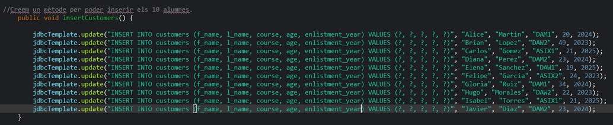
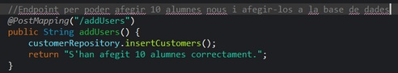
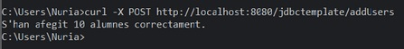
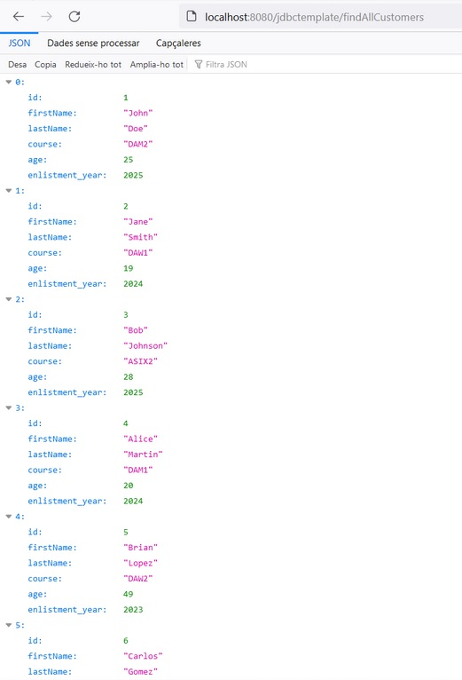

# MÒDUL: Accés a dades - Activitat RA2 - jdbctemplate + h2
Activitat que gestiona l'accés a les dades d'una base de dades sql i la mostra per pantalla mitjançant h2-console o localhost amb .json.

**1. Per fer l'endpoint GET creem la funció a CustomerRepository i després es cridarà per CustomerController:**

CustomerRepository:

CustomerController:

**El resultat, un cop executem l'aplicació, serà poder veure les dades de la base de dades que hem creat amb format JSON o també visualitzar-lo amb H2 console**

Base de dades, arxiu dades.sql per crear la taula:

Dades amb format JSON:

Dades utilitzant H2 console:

**2. Per fer l'endpoint POST creem la funció a CustomerRepository i després cridem la funció mitjançant la comanda CURL per terminal:**

CustomerRepository:

CustomerController:

Quan utilitzem curl -X POST http://localhost:8080/jdbctemplate/addUsers, si tot va bé, ens sortirà el missatge d'èxit i ho podrem visualitzar un altre cop però amb els canvis
aplicats i els nous customers afegits.

Resultat CURL per terminal:

Dades actualitzades amb format JSON:

